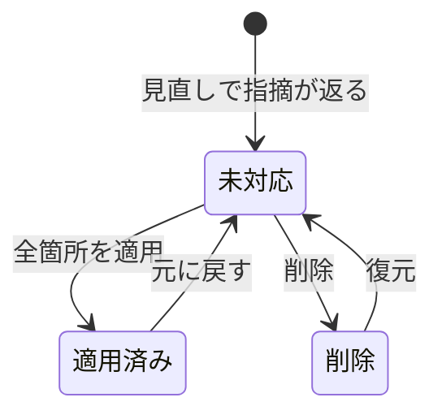

# note エディタ上のインライン校閲（v1）

関連 PRD: [auto-review](../auto-review/prd.md)

## Problem

note で記事を書く人は、公開前の最終確認を自分で行う必要がある。LLM に原稿を貼ってレビューさせる方法はあるが、指摘は本文と切り離されたテキストの一覧で返ってくる。書き手はその一覧を読みながら「どの段落のことか」を本文と一つずつ照合することになり、指摘が多いほどこの照合の手間が膨らむ。しかも画像・改行・埋め込みの実際の見え方は note の公開面でしか確かめられないので、別の画面で受けた指摘は見え方に関わる判断に使えない。

ただし、エディタ上で校閲の指摘を出すこと自体は、すでに解決済みの課題である。note 公式 AI は 2026-03 にエディタ内蔵の校閲（誤字・表記ゆれの修正と内容レビュー、無料）を出荷した。Shodo も 2025-09 に note の執筆画面へ載るブラウザ拡張を出荷しており、ボタンでチェックし、クリックで提案を適用できる。書き手ごとの規範に沿った指摘も製品として存在する。note pro でも 2026-07 から、表記ルールと過去記事の文体を反映したレビューが追加料金なしで提供されているが、対象は契約中の法人・自治体で、個人の書き手が直接使えるものではない。したがって、誤字の指摘も、書き手の規範に沿った指摘も、エディタ上に出すだけではこれらの製品の再実装になる。

これらの製品が扱っていない課題は、一次情報の該当箇所を示して追跡できる形での事実の照合である。記事中の「〜は 2024 年に始まった」「〜の利用者は 1,000 万人」のような主張が正しいかは、書き手が自分で一次情報を探して確かめるしかない。誤字の指摘と違い、事実の指摘は根拠となる出典が添えられていなければ、書き手は採否を判断できない（指摘を信じるか、改めて自分で調べ直すかの二択になる）。なお、これらの製品が事実の照合を扱っていないという判断は公開情報の範囲によるもので、Shodo と note pro の校閲範囲と品質の実地確認はまだ済んでいない。

以上から、v1 が他の製品に対して持つ差分は三つに限られる。出典付きの事実の指摘、note 以外の surface へ同じ体験を広げられる構造を持つこと（v1 の出荷範囲は note のみ）、そして書き手が自分の規範ファイルをそのまま読み込ませられ、OSS として手元で規則を足し引きできることである。三つ目の差分は薄く、規範に沿った指摘という機能そのものは差分に数えない。v1 が規範に沿った指摘を持つのは、作者が自分の推敲に使う道具として必要だからである。

この課題を今扱う理由は二つある。一つは、作者自身が note に記事を書き続けており（2026-09 時点で 26 本）、毎回の推敲でこの照合の手間を負っていること。もう一つは、公開面の上に指摘を重ねる体験が、テキストの一覧で受ける場合より実際に推敲を変えるかは、作って触らない限り確かめられないことである。v1 はストアで公開し、作者以外の note の書き手も利用者に含める。そのため、原稿を外部の LLM へ送ることへの同意と、利用にかかる費用を誰が負担するかは、v1 の範囲で決める必要がある。

v1 には二つのリスクがある。一つはアンカーの精度で、指摘が本文の正しい段落や要素を指せなければ、公開面の上に重ねる意味がなくなる。もう一つは実使用で、作った拡張を次の記事で書き手が本当に開くかは、無料の note 公式 AI と Shodo がある中では保証されない。

## 導出

`## Story` の Core actions「書いている原稿にレビューをかけて指摘を見る」「指摘を採用するか自分で判断して直す」を、note のエディタで実現する v1 の最小スコープである。

## 指摘の種類

v1 の指摘は、誤字・脱字の指摘、事実の誤りの指摘、rubric に基づく指摘の三種類である。誤字・脱字と事実は必須とする。rubric は、誰が書いても同じ基準で判定する日本語ルールと、書き手ごとに異なる文体規範の二層に分ける。二層に分けるのは、判定の根拠が違うからである。日本語ルールは日本語の正誤や一般的な読みやすさに基づくので、利用者全員に同じ既定値を配れる。文体規範は書き手本人が書いた文章に基づくので、既定値を配れず、書き手が用意しなければ機能しない。

日本語ルールには、確定的に検出できるものとできないものが混ざっている。語尾の連続、ですます調とである調の混在、同じ助詞の重複、ら抜き言葉は、形態素解析と規則で判定でき、LLM を必要としない。日本語向けの lint ルール（textlint のルール群）として既に実装がある。一方、テニオハの誤用一般（「を」と「が」の取り違えなど）と不自然な日本語表現は、文の意味を読まなければ判定できず、規則では検出しきれない。この二つは日本語ルールの層に属するが、判定には LLM を使う前提になる。

| 指摘 | 層 | 規則で確定的に検出できるか |
|---|---|---|
| 誤字・脱字 | （rubric 外） | 一部のみ |
| 事実 | （rubric 外） | できない（出典の照合が要る） |
| 語尾の連続 | 日本語ルール | できる |
| ですます調・である調の混在 | 日本語ルール | できる |
| 助詞の重複・ら抜き言葉 | 日本語ルール | できる |
| テニオハの誤用 | 日本語ルール | できない |
| 不自然な日本語表現 | 日本語ルール | できない |
| 書き手の文体規範からの逸脱 | 文体規範 | できない |

文体規範の例は、作者の場合、PROFILE.md の Writing Style と `japanese-tech-writing` skill である。ストアで公開する以上、他の書き手は自分の文体規範を持っていないことが多いので、文体規範が無い状態でも誤字・事実・日本語ルールの指摘は成り立つ必要がある。

二層の判定がぶつかる場合がある。語尾の連続は一般には避けるべきとされるが、作者の文体規範は短文のリズムを重視しており、同じ語尾を意図して重ねることがある。どちらを優先するかは解側で決める。

## Overview

書き手は note のエディタで「見直す」を実行すると、原稿が校閲され、指摘がエディタ右側のパネルに一覧される。指摘は一覧で読むだけでなく、公開面と同じ見え方の本文上にアンカーされる。修正案を持つ指摘は、本文中の該当箇所に「取り消し線つきの原文＋修正案」の差分が重ねて表示され、書き手はその場で理由を読み、原文と修正案を見比べて採否を判断する。取り消し線は実際に変わる最小の範囲に限定し、変わらない本文や句読点を含めない。訂正文は取り消し線のすぐ右に行内表示する。パネルには状態件数の行と、事実確認結果がない旨の案内文を表示しない。原稿は、書き手が「適用」を明示した場合にだけ書き換わる。

指摘の状態は 未対応 / 適用済み / 削除 の3つで、パネルには 未対応 / 対応済み の2タブを表示する。対応済みには適用済みと削除をまとめ、各カードにどちらの状態かを表示する（「すべて」タブは持たない）。削除は復元可能で、適用は元に戻せる。適用済みの指摘を選ぶと、本文側に差分のプレビューが再表示され、元に戻したとき何が変わるかを確認できる。複数箇所にまたがる指摘は箇所ごとに適用でき、一部でも未適用が残る限り指摘は未対応のまま残る。rubric の判定で出さないと決まった指摘（抑制）は、そもそも指摘の状態を持たず、カード・本文マーク・件数表示のいずれにも現れない。



課題側で未決定だった点は次のように決める。

- **二層の衝突は文体規範を優先する**。ただし抑制は、文体規範に明示された例外や許容表現に直接該当する指摘に限る。モデルが自由文の規範から衝突を推測しただけでは抑制せず、指摘として出す
- **適用と元に戻すはエディタの編集操作として行い、エディタの undo（Cmd+Z など）と同じ履歴に載る**。拡張側に別の undo 履歴を持たせると、適用と手編集が混ざったときに矛盾した順序で文字が戻り得るため
- **修正案の差分は見た目だけの重ね表示とし、適用するまで原稿の内容に含まれない**
- **レビュー後に対象箇所が編集されて修正案の原文と一致しなくなった指摘は適用できず、再見直しを促す**。古い修正案で書き手の手編集を上書きしないため
- **既定は提供者が費用を負担する標準モードとし、利用者自身の API key を使う BYOK（Bring Your Own Key）も選べる**。BYOK の費用は利用者が負担し、key の登録・解除は設定画面で行う。外部送信はストア掲載情報・プライバシーポリシー・設定画面で説明し、専用の同意ダイアログは設けない
- **事実の指摘の出典は、校閲時に一次情報（公的統計・一次報告・公式発表など）を検索して取得し、URL と根拠の該当箇所を添える**。一次情報を特定できない主張は指摘として出さない
- **文体規範は書き手が設定画面でファイルを選んで読み込ませる**。記事ごとに設定せず、同じブラウザのminaosiを使う全記事・surface・校閲モードで共有する。未設定でも誤字・事実・日本語ルールの指摘は出る

### 文体規範の設定

書き手はUTF-8のMarkdownまたはテキストファイルを一度読み込み、保存する。規範はブラウザ内に保存され、ファイル名と内容を設定画面で確認・解除できる。ファイルの更新を反映するときは読み込み直して保存する。端末間の同期や記事ごとの規範の切り替えは行わない。

通常の規範と、指摘を出さない例外を区別する。例外は「例外」「許容する表現」「許容表現」の見出しの下に箇条書きで明記するか、「本文はですます調。ただし会話部分は口語を許容」のように書く。自由文では「ただし」「但し」で始まり、「許容する」「許容します」「許容」「認める」「認めます」「使ってよい」「使用してよい」「でよい」で終わる文を例外として認識する。たとえば次の規範では、本文の常体は指摘できるが、会話部分の口語は許容する。

```markdown
# 文体規範
本文はですます調にする。

## 例外
- 会話部分では口語を許容する。
```

例外の適用条件は校閲モデルが判断する。明示された例外の引用と、対象箇所が条件を満たす理由を確認できない抑制は採用せず、指摘を残す。文体規範で抑制できるのは日本語ルール・文体の指摘であり、誤字・脱字と事実の指摘は抑制しない。抑制された指摘は校閲結果から除き、カード・本文マーク・件数に出さない。

設定した文体規範も原稿と一緒に校閲サーバー・AI提供元へ送る。検索へ規範の全文・文章のコピーを送らない。読み込める規範は64KB以下・16,000文字以内とする。

### 事実確認の検索

標準モードの検索にはCloudflare AI GatewayのWeb Search API（Ceramic.ai）を採用する。校閲モデルは現在のWorkers AIの構成を維持し、検索はAI bindingから運営者のGatewayへ送る。利用者に検索用のAPI keyを求めない。1校閲あたり最大3回・各3件とし、検索料金は$0.25／1,000回。Gatewayのクレジットまたは同プロバイダーの登録キーで支払い、アプリはクレジット購入や自動補充を行わない。Gateway未設定・認証失敗・残高不足時も検索を必要としない校閲は継続する。

検索には原稿全文・文体規範・校閲結果を送らず、照合に必要な検索語だけを送る。検索結果の抜粋だけを根拠に指摘を確定せず、参照先の一次情報と該当箇所を確認する。検索の取得失敗・アクセス制限・一次情報の取得失敗は「事実確認が完了した」と扱わない。出典付きの事実の指摘だけを確認済みとして示し、誤字・日本語ルールなど検索を必要としない校閲は継続できる。

Cloudflareの[公式プロバイダー一覧](https://developers.cloudflare.com/web-search/providers/)ではCeramic.aiはZero Data Retention対応とされている。Gateway側のログ保存は別の設定なので、運営者は本文ログ・キャッシュを無効にする。設定画面で検索語の送信先と保持条件を明示する。

### 原稿の外部送信と学習への利用

Chrome Web Store の掲載情報には、原稿本文を校閲サーバーと AI 提供元へ送信して校閲することを、インストール前に分かる形で明記する。Privacy practices の申告とプライバシーポリシーは実際の動作と一致させ、ポリシーには収集するデータ・用途・すべての送信先・保存期間・ログの扱いを記載する。利用者はこの説明を踏まえて拡張をインストールする。利用規約への記載だけで説明を済ませない。[Chrome Web Store の開示要件](https://developer.chrome.com/docs/webstore/program-policies/policies#disclosure-requirements)と[審査対応資料](https://developer.chrome.com/docs/webstore/troubleshooting/#user-data-policy---prominent-disclosure)を公開時の確認根拠とする。

拡張の設定画面には、選択中のモードで送信するデータ・用途・送信先・学習への利用の有無を示し、プライバシーポリシーへのリンクを置く。指摘パネルにはこの説明を追加せず、「見直す」の初回・毎回とも専用の同意ダイアログは表示しない。

minaosi は原稿と校閲結果を AI モデルの学習に利用しない。標準モードでは、利用するすべての外部サービスでも原稿・校閲結果・原稿から作る検索語や差分を学習に利用しない条件を満たし、「標準モードで送信する原稿と校閲結果は、AI モデルの学習には利用されません」と設定画面に明記する。学習用のデータ共有には許可を与えない。現在の Workers AI の条件は、[Cloudflare のデータ利用方針](https://developers.cloudflare.com/workers-ai/platform/data-usage/)で確認できる。検索サービスを追加する場合も、そのサービスの条件を確認してから標準モードの送信先に加える。

BYOK の提供元による学習への利用は、選択した提供元・モデルの条件と利用者のアカウント設定に従う。設定画面では提供元の方針へのリンクと必要な条件を示す。たとえば Anthropic API と OpenAI API は既定で学習に利用しないが、利用者がデータ共有に参加する場合は条件が変わる。学習不使用を確認できない送信先には、その旨を示し、標準モードと同じ保証を表示しない。[Anthropic API の方針](https://privacy.claude.com/en/articles/7996885-how-do-you-use-personal-data-in-model-training)、[OpenAI API の方針](https://developers.openai.com/api/docs/guides/your-data)

学習への利用とデータの保存は別に説明する。学習不使用を、原稿や応答が一切保存されないという意味で表示しない。送信先や学習への利用条件が変わる場合は、設定画面と掲載情報・ポリシーを更新し、既存利用者にも変更を通知する。

### Goals

- 指摘を本文の見え方の上で受け取れるようにし、一覧と本文を照合する手間を減らす
- 採否の判断材料（種類・理由・出典・原文と修正案の対比）を指摘箇所のすぐ隣で提示する
- 原稿を書き換える主導権を書き手に残す（自動適用なし・明示適用・復元可能な削除・エディタの undo と矛盾しない元に戻す）
- 書き手自身の文体規範をそのまま読み込ませ、規範が無い場合でも誤字・事実・日本語ルールの指摘が成立する

### Non-Goals

- 原稿の自動生成・自動適用（提案の提示と適用の実行は分離する）
- 指摘の切り離されたレポート表示を主 UI にすること
- 抑制した指摘の表示（「許容」「対応不要」としても出さない）
- 全状態を混在させて一覧するビュー（「すべて」タブ）
- note 以外の surface への対応（surface 差分の adapter 隔離はプロジェクトのアーキテクチャ方針として別途守る）
- 見直し実行前の費用見積もり表示
- 複数の LLM 提供元への同時対応（v1 は設定した提供元1系統のみ）
- 外部送信専用の同意ダイアログと、指摘パネル内での送信・学習への利用に関する説明
- 修正案差分の描画方式や判定実装の選定（overlay 描画・形態素解析・textlint・LLM の振り分けは設計で決める）

## Glossary

正本は repo root `AGENTS.md` の `## Glossary`。本文の理解に要る語だけを引く。

- **原稿（draft）**: 書き手が surface のエディタで書いている、公開前の記事本文
- **指摘（finding）**: 原稿の特定箇所に対する校閲の結果。種類（誤字・事実・日本語ルール・文体規範）、対象箇所のアンカー、理由を持ち、事実の指摘は出典を持つ。原稿を書き換える操作は含まない（適用は書き手が行う）
- **アンカー（anchor）**: 指摘が原稿のどの要素（段落・画像・改行など）を指すかの参照
- **出典（source）**: 事実の指摘の根拠となる一次情報の参照（URL と該当箇所）
- **surface（surface）**: 原稿を書き、公開面と同じ見え方で表示する執筆画面。v1 は note のエディタ
- **rubric（rubric）**: 何を指摘し何を指摘しないかの規範。日本語ルールと文体規範の二層からなる
- **日本語ルール（language rule）**: rubric のうち、誰が書いても同じ基準で判定する層（語尾の連続・文体の混在・テニオハなど）。共通の規則を全利用者に適用する
- **文体規範（style guide）**: rubric のうち、書き手本人が書いた文章による層（文末・語彙・段落構成・リズムなど）。書き手が用意しなければ存在しない

この機能内に閉じる語:

- **修正案（suggestion）**: 指摘が持つ、適用可能な置き換えの組（原文 → 修正案）。説明文だけの指摘は修正案を持たない
- **抑制（suppressed）**: rubric の判定で指摘を出さないと決めた判定結果。指摘の状態ではなく、抑制された指摘は UI には一切現れない
- **部分適用（partial apply）**: 同じ指摘が複数箇所にまたがるとき、箇所ごとに個別に適用すること。すべての箇所を適用して初めて指摘が適用済みに遷移し、それまでは未対応に留まる

## Acceptance Criteria

表示と選択:

- [ ] 「見直す」を実行すると実行中であることが分かり、完了時に指摘パネルが開く
- [ ] 指摘はパネルのカードに種類・タイトル・理由が出る
- [ ] 事実の指摘には、対象の主張を支持または否定する一次情報へのリンクと、根拠の該当箇所が示される
- [ ] 一次情報を特定できない事実の指摘は表示されない
- [x] 標準モードでは AI Gateway Web Search API（Ceramic.ai）で検索し、利用者に検索用の API key を求めない。送信するのは照合に必要な検索語のみで、原稿全文・校閲結果は送らない
- [x] 検索結果の抜粋だけで事実の指摘を確定せず、参照先の一次情報と該当箇所を確認する
- [x] 検索や一次情報の取得に失敗しても校閲を継続し、出典のない主張を事実確認済みとして扱わない
- [ ] 修正案を持つ指摘は、本文の該当箇所に取り消し線つき原文と修正案の差分が重ねて表示される
- [ ] カードを選ぶと本文側の該当箇所だけが強調され、対応する本文へスクロールする（段落全体や文全体は囲わない）
- [ ] 指摘が0件のときは、その旨が分かる表示になる

適用と取消:

- [ ] 原稿は「適用」の明示操作でのみ書き換わる。指摘の表示や選択だけでは変わらない
- [ ] 修正案は適用するまで原稿の内容に含まれない（保存される原稿に差分表示が混入しない）
- [ ] レビュー後に該当箇所が編集され修正案の原文と一致しない指摘は適用できず、再見直しを促す表示になる
- [ ] 適用した修正はエディタの undo（Cmd+Z など）で1つの編集操作として戻る。部分適用の場合も、1箇所の適用がそれぞれ1つの編集操作として扱われる
- [ ] 適用済みのカードを選ぶと本文に差分プレビューが出て、「元に戻す」で原文に戻る
- [ ] 複数箇所にまたがる指摘は箇所ごとに適用でき、一部だけ適用された指摘は未対応タブに残り、すべて適用した時点で適用済みになる
- [ ] 「削除」した指摘は対応済みタブに残り、復元で未対応に戻せる
- [ ] 対象箇所を一意に特定できない指摘は、誤った箇所を強調・適用しない
- [ ] パネルを閉じて再び開いても指摘と状態は保持される。再度「見直す」を実行したときだけ指摘と状態が作り直される

rubric と抑制:

- [ ] 文体規範が未設定でも、誤字・事実・日本語ルールの指摘は出る
- [ ] 文体規範のファイルを設定・確認・解除でき、保存した内容が全記事・surface・校閲モードで指摘の生成と抑制に反映される
- [ ] 文体規範に明示された例外に該当しない指摘は抑制されない。該当する指摘はカード・本文マーク・件数表示のいずれにも現れない

外部送信:

- [ ] ストア掲載情報には、原稿本文を校閲サーバーと AI 提供元へ送信して校閲することがインストール前に分かる形で記載され、Privacy practices の申告・プライバシーポリシー・実際の動作が一致する
- [ ] 設定画面では、選択中のモードで送信するデータ・用途・送信先・学習への利用条件を確認でき、プライバシーポリシーへのリンクがある。指摘パネルにはこの説明を表示しない
- [ ] 「見直す」の初回・毎回とも、外部送信専用の同意ダイアログを表示しない
- [ ] 設定画面には、標準モードで送信する原稿と校閲結果が AI モデルの学習に利用されないことが明記され、校閲・検索に用いるすべての送信先の条件と一致する
- [ ] BYOK では、提供元・モデルの学習への利用条件と利用者が確認すべきアカウント設定を示す。学習不使用を確認できない場合はその旨が分かり、学習に利用されないと一律には表示しない
- [ ] プライバシーポリシーには原稿・応答・ログの保存先と保存期間が記載され、学習不使用と保存しないことが区別されている。送信先や学習への利用条件の変更は既存利用者にも通知される
- [ ] API key は設定画面で登録・解除でき、送信先の提供元が表示される
- [ ] BYOK 選択時に API key が未設定で「見直す」を実行しようとすると、必要な設定方法が案内される。標準モードでは利用者の API key 登録なしに実行できる
- [ ] 校閲本体の通信失敗や API エラーで見直しが完了しなかったとき、結果は表示されず理由と再試行の手段が示される。検索だけの失敗は、確認範囲を示した部分的な結果として扱う

## Success Metrics

- コアアクション: 記事の推敲中に「見直す」を実行し、返ってきた指摘の少なくとも1件に「適用」「元に戻す」「削除」のいずれかを行う
- 期待頻度 (cycle): 記事を書くたび（作者の現在のペースで月数本）
- 数える対象: note のエディタを自分で開き「見直す」を実行した人のうち、コアアクションに到達した数
- 主指標: 初回の見直し実行から30日以内に、次の別の記事の推敲でも「見直す」を実行した人の割合

v1 は利用イベントを収集する計測基盤を持たないため、初期の評価は作者自身の利用記録で行う。ストア公開後に利用者全体へ広げて計測する方法は、その段階で別途決める。

## 未決事項

- Ceramic.aiのZDR条件と検索先Gatewayの本文ログ・キャッシュ無効化の確認
- Web Search APIからの取得成功率・日本語の一次情報の検索品質・遅延の実測と、利用枠超過・アクセス制限時の扱い
